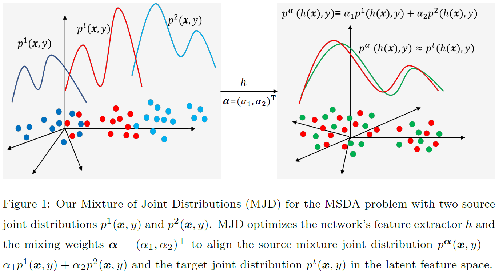
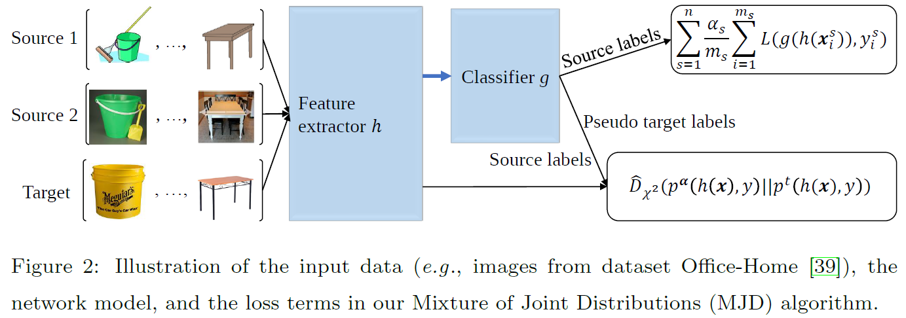

# Mixture-of-Joint-Distributions (MJD)

This repository provides the Pytorch code for the work "Multi-Source Domain Adaptation with Mixture of Joint Distributions" published in Pattern Recognition, 2024. The main idea of the work is illustrated in Fig.1.

For quick demonstration, in the code, the network model is a one-hidden-layer neural network, and the dataset for evaluating the MJD algorithm is the PIE dataset (see dataset description in the paper "Domain Generalization by Joint-Product Distribution Alignment" published in Pattern Recognition, 2022.)

In the work, we study the Multi-Source Domain Adaptation (MSDA) problem. By introducing the concepts of mixture joint distribution and Pearson $\chi^{2}$ divergence, we develop theory and algorithm for the MSDA problem. (1) We first develop a theory showing that a neural network's target loss is upper bounded by both its source mixture loss and the Pearson $\chi^{2}$ divergence between the source mixture joint distribution and the target joint distribution. (2) We then propose an algorithm that optimizes both the mixing weights and the neural network to minimize the estimated source mixture loss and the estimated Pearson $\chi^{2}$ divergence (see Fig.2).

For details of the theory and algorithm in this multi-source domain adaptation work,  please refer to the paper below: 

@article{Chen2024Multi,  
  author={Sentao Chen},  
  journal={Pattern Recognition},   
  title={Multi-Source Domain Adaptation with Mixture of Joint Distributions},   
  year={2024},   
  volume = {},  
  pages={},   
  issn = {},  
  doi={https://doi.org/10.1016/j.patcog.2024.110295}   
  }

